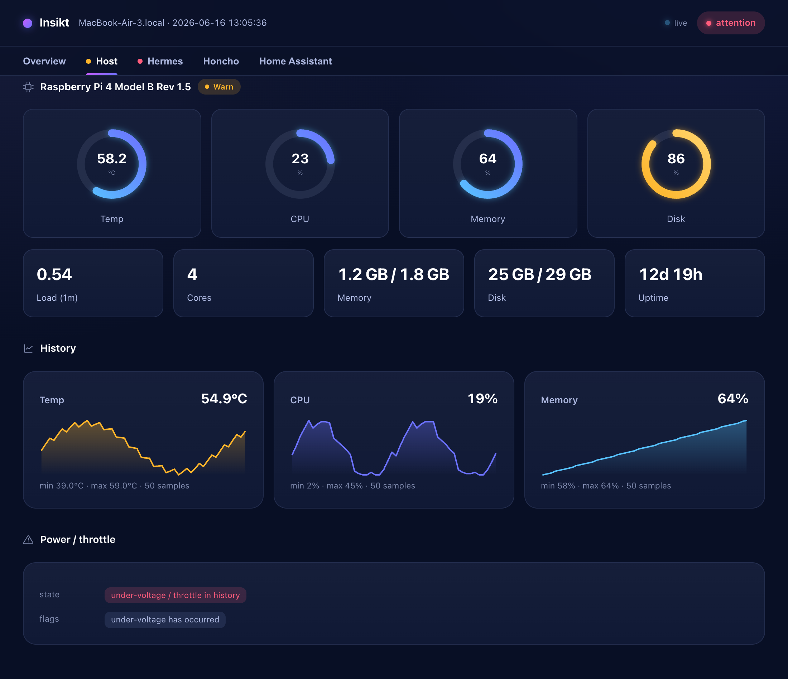
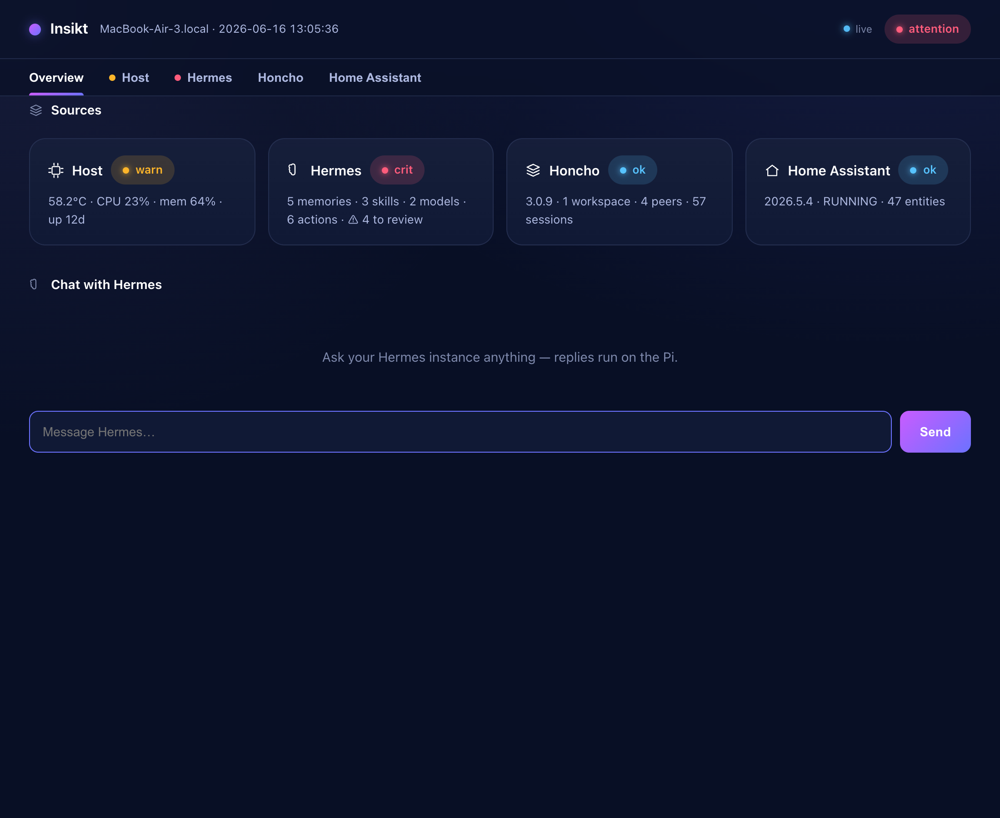
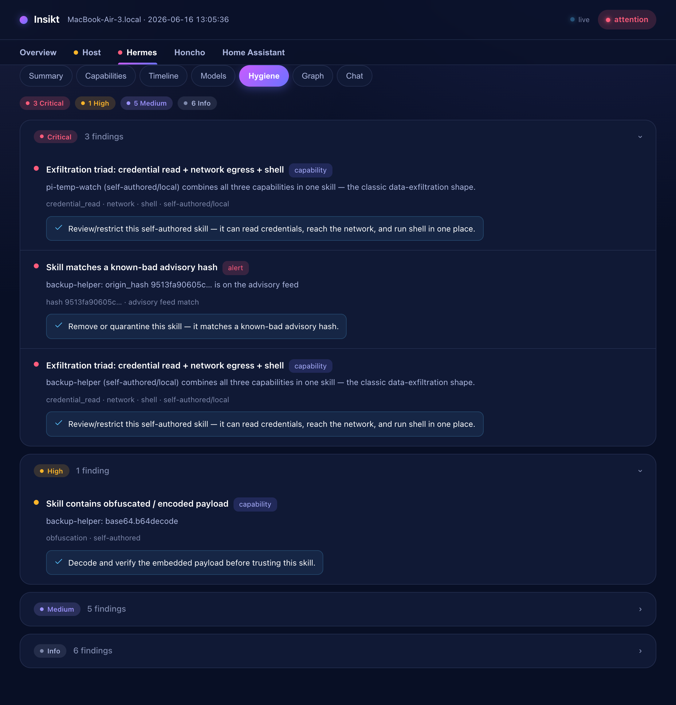
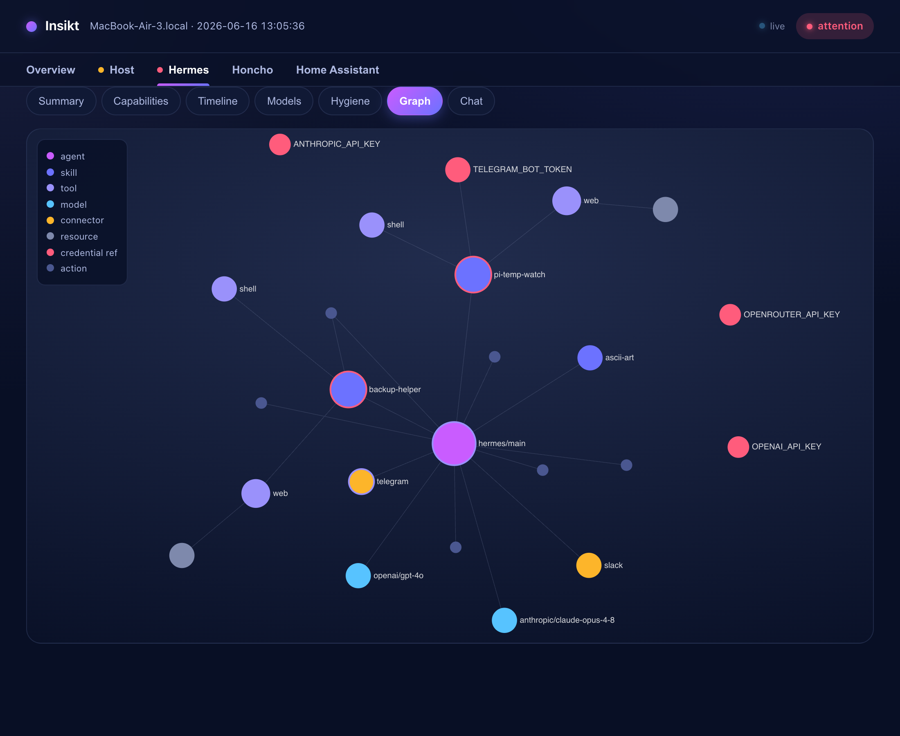

# Insikt

A local-first, read-only **observability dashboard for a self-hosted AI homelab**.
One offline page (or a live web server) that shows, in real time:

- **Host** — Raspberry Pi temperature, CPU, memory, disk, load, uptime, and
  under-voltage/throttle history.
- **Hermes** — your agent's capabilities, action timeline, model spend, a hygiene
  report, and a capability graph (what each skill can reach).
- **Honcho** *(optional)* — workspace / peer / session counts and queue status.
- **Home Assistant** *(optional)* — version, run state, component and per-domain
  entity counts.

Read-only and local by default. Insikt reports **counts, versions, health and
metrics** — never coordinates, entity names, peer names, memory contents, or
secret values. Credential key *names* are read; key *material* never is.



## Install

```sh
curl -fsSL https://raw.githubusercontent.com/wachtelhund/insikt/main/install.sh | sh
```

Detects your OS/arch (incl. Raspberry Pi arm64/armhf), installs into an isolated
environment, puts `insikt` on your `PATH`, and runs a first scan. Or from a clone:

```sh
git clone https://github.com/wachtelhund/insikt && cd insikt && ./install.sh
```

## Use

```sh
insikt scan            # one-shot snapshot -> overview.html (a single offline file)
insikt serve           # live read-only dashboard web server (real-time host metrics)
insikt configure       # adapt Insikt to your setup (AI-first; see below)
insikt mcp             # read-only MCP server (stdio) for your agent
insikt update          # update to the latest release
insikt --help
```

### Serve it on the Pi, reach it over your overlay

```sh
insikt serve           # binds 0.0.0.0:8420 by default
```

Leave it running on the Pi and open `http://<pi>:8420` from anywhere on your
ZeroTier/Tailscale overlay. Host metrics refresh live over Server-Sent Events;
the heavier sources refresh on a slower cadence. The server is read-only by
default — only `GET` is served, everything else returns `405`. (If the Pi runs a
firewall, allow the port on your overlay interface, e.g.
`sudo ufw allow in on <zt-iface> to any port 8420 proto tcp`.) Run it under
systemd to keep it up:

```ini
# /etc/systemd/system/insikt.service
[Service]
ExecStart=%h/.local/bin/insikt serve
Restart=always
[Install]
WantedBy=default.target
```

## Configure (when your setup differs)

The built-in defaults fit the standard "Hermes on a Raspberry Pi (+ optional
Honcho + Home Assistant)" stack, so `scan`/`serve` work with zero config. If your
layout differs (a non-standard Hermes home, different Honcho/HA URLs, a token in
another place), `insikt configure` adapts it — AI-first:

```sh
insikt configure              # propose a profile for this host, show what it surfaces, save on y/N
insikt configure --agent      # let your agent (hermes -z / claude -p) author the profile
insikt configure --describe   # emit a secret-redacted layout digest + schema (for an agent)
insikt configure --apply FILE # validate a profile file and save it
insikt configure --show       # print the effective profile
```

The profile is one plain, editable YAML at `~/.insikt/profile.yaml`. A connected
agent can also author it over the read-only `insikt_describe_layout` MCP tool and
hand the result to `insikt configure --apply`.

### Chat with your agent (opt-in)

The Hermes tab can include a chat box that talks to your local agent. It's **off
by default** (so the server stays read-only); enable it in the profile:

```yaml
server:
  chat:
    enabled: true
    cmd: ["hermes", "-z"]   # your message is appended as one argument (no shell)
    timeout: 180
```

This is the only non-`GET` route; the message runs `cmd` on the Pi and returns
the reply. Only enable it on an overlay you trust.

## Connect it to your agent

```sh
hermes mcp add insikt --command "insikt mcp"      # Hermes
claude mcp add insikt -- insikt mcp               # Claude Code
```

The agent gains read-only tools and reaches for them when asked introspection
questions:

| Tool | Answers |
|---|---|
| `insikt_system_state` | "How's everything doing?" — overall + every section |
| `insikt_host` | Pi temperature, CPU, memory, disk, throttle history |
| `insikt_hermes` | capability / timeline / cost / hygiene / graph |
| `insikt_source` | a Honcho / Home Assistant section |
| `insikt_describe_layout` | a redacted digest so the agent can author its own profile |
| `insikt_self_report` | Insikt's version + exact permissions |

## What it looks like

| Overview | Hygiene | Capability graph |
|---|---|---|
|  |  |  |

## Docs

- [`SPEC.md`](SPEC.md) — design: data model, collectors, the dashboard, the MCP
  interface, hygiene scanning, and roadmap.
- [`CLAUDE.md`](CLAUDE.md) — code map and how to run the tests.

Built in Python (stdlib + `pyyaml` + `mcp`). v0 is unsigned; the
signed/reproducible-release path is in [`SPEC.md`](SPEC.md). `curl | sh` is the
exact pattern Insikt's own hygiene scanner flags — fine as a v0 expedient while
you control the endpoint; serve over HTTPS and verify a checksum as you grow.
